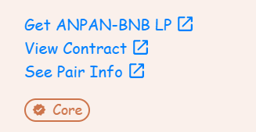

# Smart Contracts

This page provides links or locations for AnpanSwap's smart contracts.

## Main contracts

The following links will take you to the BscScan page for AnpanSwap's main smart contracts.

* [AnpanSwap: Main Staking Contract (MasterChef) 0x305E193C7B6955564D0D3D35d918FF1f27F3A610](https://bscscan.com/address/0x305E193C7B6955564D0D3D35d918FF1f27F3A610#code)
* [AnpanSwap: Factory Contract 0xEb4D933D56E5deF7B24F543766dD398f1DaFEEd5](https://bscscan.com/address/0xEb4D933D56E5deF7B24F543766dD398f1DaFEEd5#code)
* [AnpanSwap: Router Contract 0xe8d2c4ca811e0445B83326aBe85B7c40C66759eD](https://bscscan.com/address/0xe8d2c4ca811e0445B83326aBe85B7c40C66759eD#code)

## Farms contracts

Each Farm used by AnpanSwap has its own smart contract. Follow the steps below to view a Farm's smart contract.

1. Go to the [AnpanSwap Farms page](https://anpanswap.finance/farms) and click the row of the Farm you want to see the contract for.

1. When the details section expands out, click the **View Contract** link on the left to open the contract in BscScan.

