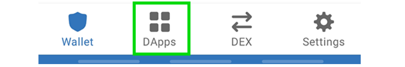

# Connect Your Wallet to AnpanSwap

You've made a wallet and gotten your BEP20 tokens, now you just need to connect your wallet with AnpanSwap and you're good to go!

Check out the steps below for how to connect each of our recommended wallets to AnpanSwap.

## Smartphone/Mobile

### Trust Wallet

To connect Trust Wallet follow the steps below. Note that Android and iOS devices do not use the same steps!

### **Android**

1. Open Trust Wallet and tap the **DApps** button on the bottom of the screen.

1. Input "anpanswap.finance" into search field on the top to search and choose DApp "AnpanSwap".

1. Tap the "Ethereum" icon on the top, and then tap the "Smart Chain" to switch to BSC network.

1. Tap the "Connect" button on AnpanSwap DApp, and then tap the "TrustWallet".

1. A new page will open with the AnpanSwap information. Tap the Connect button.

**Warning:** If you find you are unable to connect at step 5, go back to the DApps menu and find "AnpanSwap" again. Using "Anpan Swap" from the "History" section may result in the same problem.

### **iOS**

Trust Wallet have prepared a detailed guide on using WalletConnect for iOS.

Read the [Trust Wallet guide to connecting to BSC DEX via WalletConnect](https://community.trustwallet.com/t/using-walletconnect-to-access-pancakeswap/212307) for reference to connect to AnpanSwap.

**Resources**   
[**Download Trust Wallet**](https://trustwallet.com/) \(Automatically detects device\)  
[**Trust Wallet Setup Guide**](https://www.binance.com/en/blog/421499824684901157/how-to-set-up-and-use-trust-wallet-for-binance-smart-chain)

### MetaMask

To connect MetaMask to AnpanSwap follow the steps below.

### **Android and iOS**

1. Open MetaMask and tap on the **burger icon** in the top-left.

1. Tap **Settings** in the menu.

1. In the Settings menu, tap on **Network**.

1. Tap on the **Add Network** button at the bottom.

1. On the page that opens, type in the following details:

**Network Name:** Binance Smart Chain  
**RPC Url:** [https://bsc-dataseed.binance.org](https://bsc-dataseed.binance.org)  
**Chain ID:** 56  
**Symbol:** BNB  
**Block Explorer URL:** [http://bscscan.com](http://bscscan.com)

1. Once you've confirmed entry of the new network, go back to the burger menu and tap **Browser**.

1. Type "AnpanSwap" into the search field and start the search. The top result will be the AnpanSwap (anpanswap.finance). Tap to enter it.
2. Tap the connect button on DApp "AnpanSwap", and on the page that opens, tap **Connect** to connect to AnpanSwap.

**Resources**   
[**Download MetaMask**](https://metamask.io/download.html) \(Automatically detects device\)  
[**MetaMask Setup Guide**](https://academy.binance.com/en/articles/connecting-metamask-to-binance-smart-chain)

### Token Pocket

Token Pocket is a cryptocurrency management app that natively supports many cryptocurrency networks. It also has a desktop application available.

### **Android and iOS**

1. Tap the **Discover** button on the bottom of the main screen.

1. Input "anpanswap.finance" into search field on the top to search and choose DApp "AnpanSwap".

1. A window will open saying that you will be opening a third party DApp. Tap **I got it** and you'll be taken to AnpanSwap's website.

1. Tap the connect button on DApp "AnpanSwap", and on the page that opens, tap **TokenPocket** to connect to AnpanSwap.

**Resources**   
[**Download Token Pocket App**](https://www.tokenpocket.pro/en/download/app) \(Automatically detects device\)

### SafePal

SafePal is available as both a software and hardware wallet. The wallet is easy to install and create, and comes ready to support BEP2 \(Binance Chain\) and BEP20 \(Binance Smart Chain\) right away.

### **Android and iOS**

1. Tap the **4 squares** icon button on the bottom of the main screen.

1. Input "anpanswap.finance" into search field on the top, and then tap the "Ethereum" icon on the top-right & choose "BSC" to switch to BSC network.

1. A window will open saying that you will be opening a third party DApp. Tap **Confirm** and you'll be taken to AnpanSwap's website.

1. Tap the connect button on DApp "AnpanSwap", and on the page that opens, tap **SafePal** to connect to AnpanSwap.

**Resources**   
​[**Download SafePal**](https://safepal.io/download) \(Automatically detects device\)  
[**SafePal Setup Guide**](https://blog.safepal.io/binance-smart-chain-x-safepal/)

## Desktop/Web Browser wallets

### MetaMask

### **Chrome and Firefox**

1. Open MetaMask and click on the **network selector** at the top. By default it will show "Ethereum Mainnet". Scroll down and click **Custom RPC**.

1. A window will open. Type in the details below.

**Network Name:** Binance Smart Chain  
**New RPC URL:** [https://bsc-dataseed.binance.org](https://bsc-dataseed.binance.org)  
**Chain ID:** 56  
**Currency Symbol \(optional\):** BNB  
**Block Explorer URL \(optional\):** [http://bscscan.com](http://bscscan.com)

1. Make sure you've typed everything in correctly and click **Save**. Binance Smart Chain will now be one of your network options.

1. Visit the [AnpanSwap website](https://anpanswap.finance/). In the top left corner you'll see the **Connect** button. Click it.

1. A window will appear asking you to choose a wallet to connect to. Click **MetaMask** \(it's the top option on the list\).

**Resources**   
[**Download MetaMask**](https://metamask.io/download.html) \(Automatically detects browser\)  
[**MetaMask Setup Guide**](https://academy.binance.com/en/articles/connecting-metamask-to-binance-smart-chain)

### Binance Wallet

### **Chrome and Firefox**

1. Open Binance Chain Wallet and click on the network selector at the top. The default network will be Binance Chain. Choose **Binance Smart Chain** from the list.

1. Visit the AnpanSwap website. In the top-left, click **Connect**.

1. A window will appear asking you to choose a wallet to connect to. Click **Binance Chain**.

**Resources**   
[**Download Binance Wallet**](https://www.binance.org/en) \(Automatically detects browser\)

### Token Pocket

### **Desktop Application**

1. When you open the application, DApps should be the default page \(if not, click to the DApps page\).
2. Half way down the page you'll see a list of networks to choose from. Click **BSC**.

1. On the list of BSC DApps, you'll find AnpanSwap links. Click a **AnpanSwap** link.

**Warning**: Make sure you don't choose the "AnpanSwap data analysis" option. If you do, you will not be able to connect.

1. Your browser will open a AnpanSwap tab and attempt to connect to Token Pocket.

**Warning**: You will not be able to use both MetaMask and TokenPocket connecting through the same web browser. Make sure you use a web browser without MetaMask plugin installed if you're using TokenPocket on your desktop computer.

**Resources**   
[**Download Token Pocket Desktop Wallet**](https://www.tokenpocket.pro/en/download/pc) \(MacOS or Win64\)  

**Danger**: **Remember - NEVER, under any situation, should you ever give someone your private key or recovery phrases.**