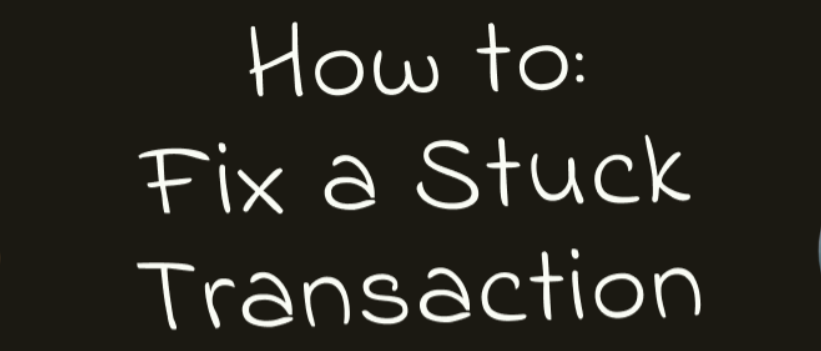
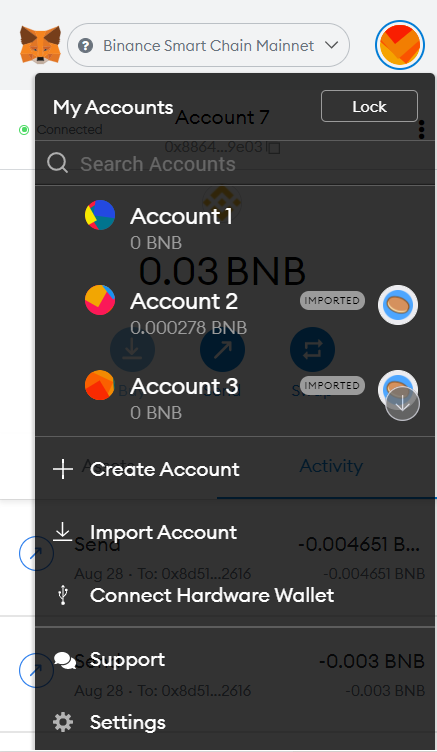
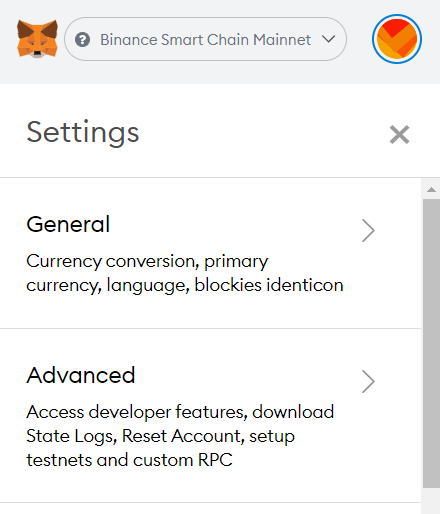
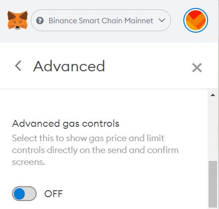
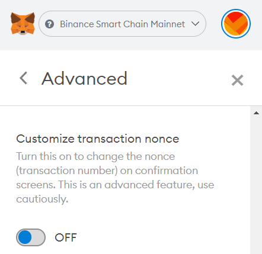
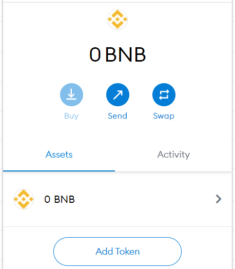
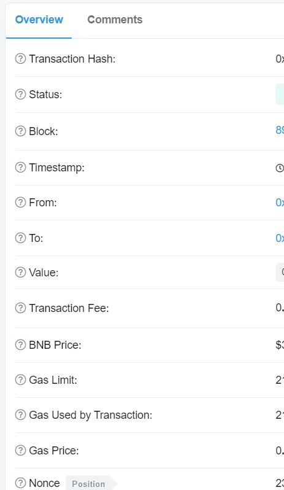

# Fixing Stuck Pending Transactions on MetaMask
How to "unstick" any pending transactions that are stuck in your MetaMask

If your transaction is stuck on pending in Metamask, and the “Cancel” button isn’t helping, you might need to use this method to clear your backlog.

This method works by essentially overwriting the stuck transaction with another, higher-priority transaction.

### **1. Enable Customized Transaction Nonce**

1. Open your MetaMask plugin.

2. Click on the colorful circle icon on the top-right and click **Settings** from the dropdown menu.

3. In the Settings menu, select **Advanced**.

4. Scroll down until you see **Advanced gas controls**. Toggle this to ON.

5. Still in Advanced settings, keep scrolling until you see **Customize transaction nonce**. Toggle this to ON.

### **2. Find Your Stuck Transaction**

We’re now going to find the transaction that’s stuck, and make a note of the “nonce”. That’s a kind of identifier, which we’ll re-use later.

6. Go back to the top page of MetaMask. In the “Assets” tab, find the token type of your stuck transaction \(in this case, BNB\).

7. In the token’s menu, find your **Pending** transaction in the Queue area. Click on your transaction for more details.

8. Look for the **Nonce** entry, and take note of this number.

### **3. Overwrite the Stuck Transaction**

Now we’re going to make a new transaction to replace the stuck one. We’ll customize the Nonce number, so that it’s the same as the one that you just wrote down.

9. Create a new transaction to replace your stuck transaction. This time around, increase the **Transaction Fee**. Here we’ve increased it from 9 to 20. This will make it more likely for  your transaction to be added to a block.

10. On the confirmation page, make sure your Gas Price is now at your new, higher amount. 

11. Find the **CUSTOM NONCE** entry and change the nonce to the number you wrote down in step 8. Now click Confirm.

12. Your new transaction should now be accepted into a block. To check, open MetaMask and click the **Activity** tab.

13. Your completed transaction should show at the top of your Activity list. If it still says “Pending” in orange you’ll need to wait a little longer, or try the process again with an even higher transaction fee \(gas price\).

Since no wallet can create two transactions of the same nonce, if the replacement transaction you make is successful, your stuck transaction will be canceled.