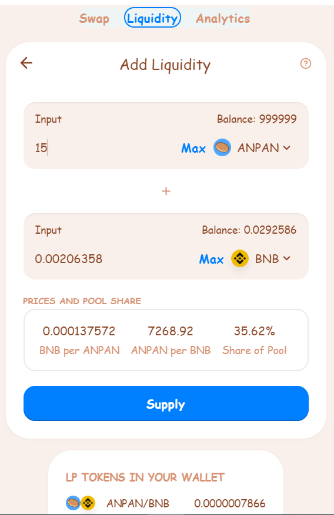
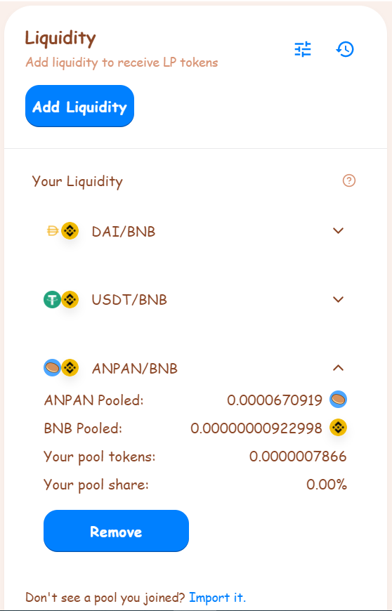

# Liquidity Pools

When you add your token to a Liquidity Pool you will receive Liquidity Provider \(LP\) tokens and share in the fees.

## LP Tokens

As an example, if you deposited **ANPAN** and **BNB** into a Liquidity Pool, you'd receive **ANPAN-BNB LP** tokens.

The number of LP tokens you receive represents your portion of the ANPAN-BNB Liquidity Pool.

You can also redeem your funds at any time by removing your liquidity.

## Liquidity Providers earn trading fees

Providing liquidity gives you a reward in the form of trading fees when people use your liquidity pool. 

Whenever someone trades on AnpanSwap, the trader pays a 0.2% fee, **of which 0.17%** is added to the Liquidity Pool of the swap pair they traded on.

For example:

* There are 10 LP tokens representing 10 ANPAN and 10 BNB tokens.
* 1 LP token = 1 ANPAN + 1 BNB
* Someone trades 10 ANPAN for 10 BNB.
* Someone else trades 10 BNB for 10 ANPAN.
* The ANPAN/BNB liquidity pool now has 10.017 ANPAN and 10.017 BNB.
* Each LP token is now worth 1.00017 ANPAN + 1.00017 BNB.

To make being a liquidity provider even more worth your while, you can also put your LP tokens to work whipping up some fresh yield on the [ANPAN Farms](https://anpanswap.finance/farms), while still earning your 0.17% trading fee reward.

## Impermanent Loss

Providing liquidity is not without risk, as you may be exposed to impermanent loss.

  
[“Simply put, impermanent loss is the difference between holding tokens in an AMM and holding them in your wallet.” - Nate Hindman](https://blog.bancor.network/beginners-guide-to-getting-rekt-by-impermanent-loss-7c9510cb2f22)