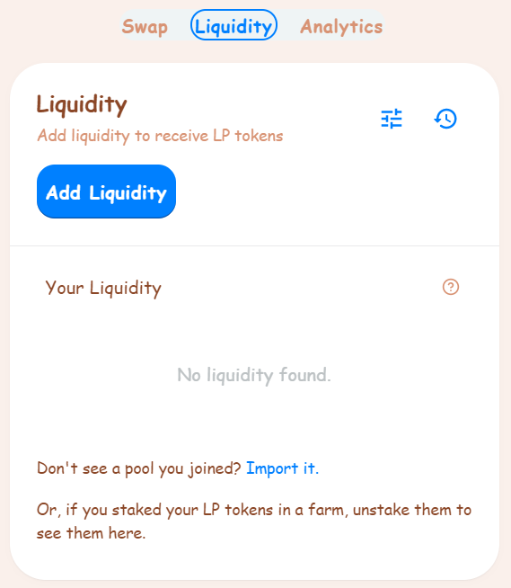
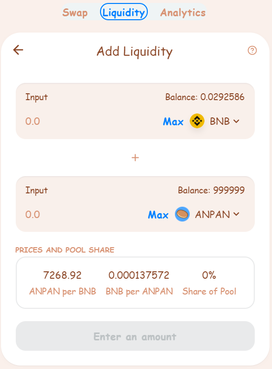
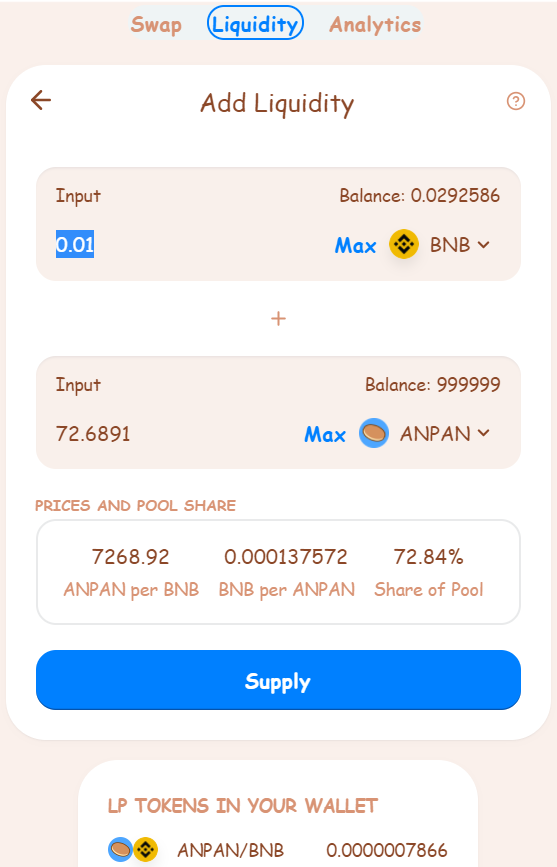
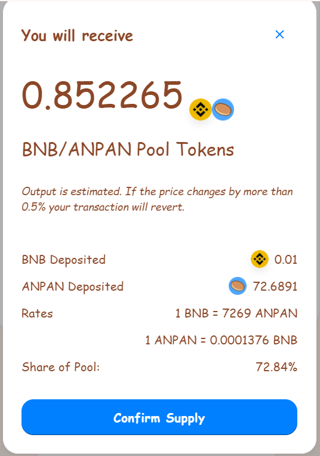
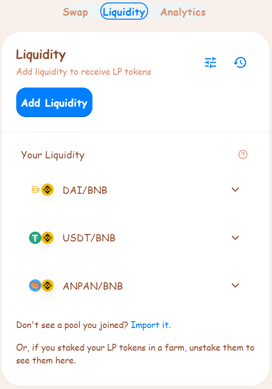
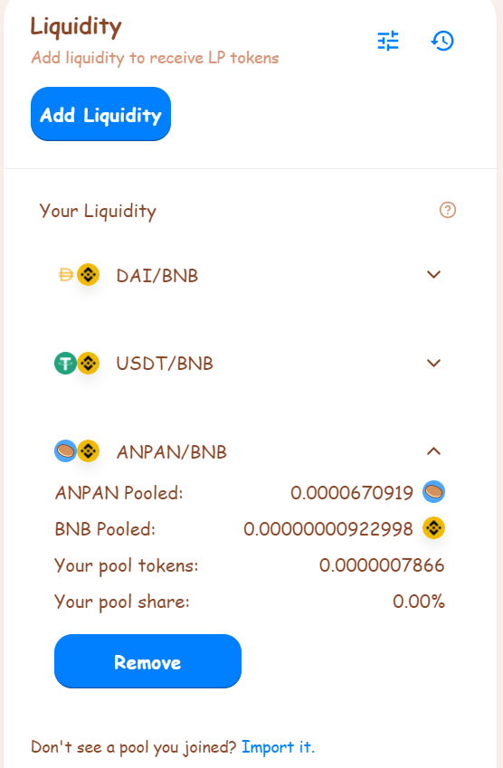
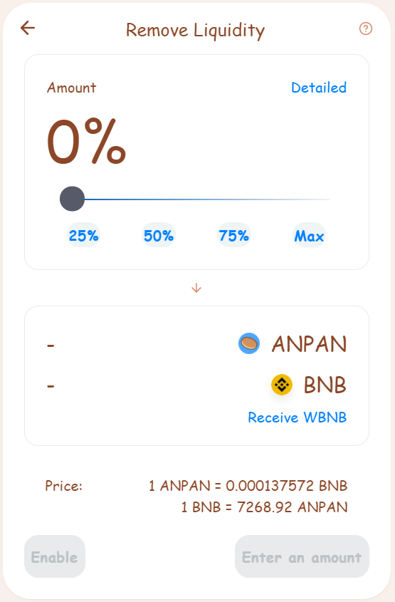
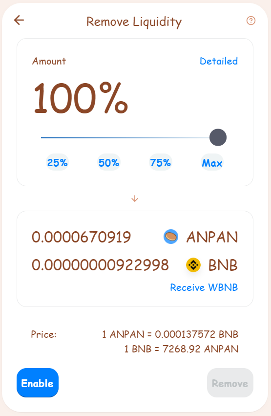
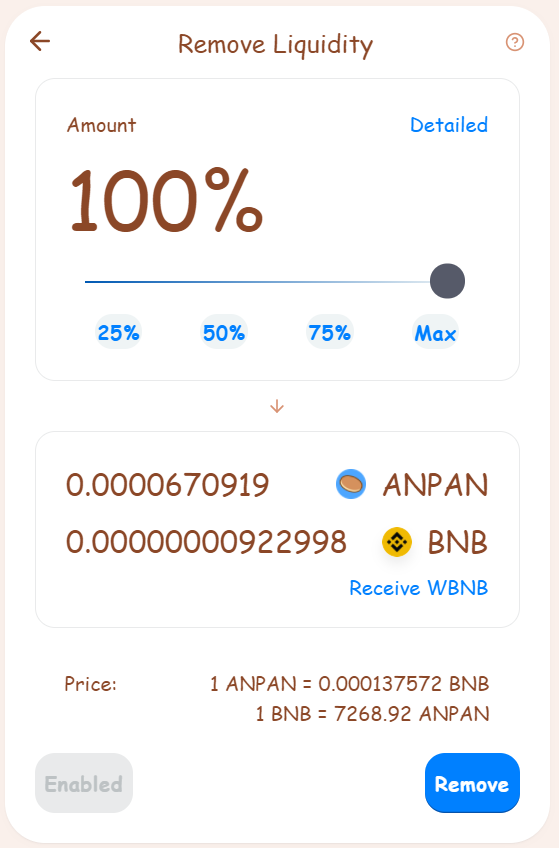
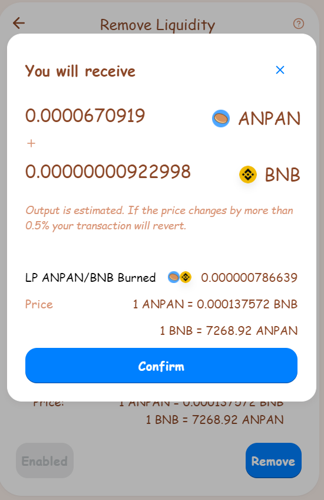

# How to Add/Remove Liquidity

"Liquidity" is central to how AnpanSwap's Exchange works. You can add liquidity for any token pair by staking both through the Liquidity page.

In return for adding liquidity, you'll receive trading fees for that pair, and receive LP Tokens you can [stake in Farms](https://docs.anpanswap.finance/#/products/yield-farming/farming) to earn ANPAN rewards!

### **Adding liquidity**

To provide liquidity, you’ll need to commit an amount of any token pair you like. Your lowest value \(in USD\) of the two tokens will be the limit to the liquidity you can provide.

You can easily trade for any tokens you need. Visit our [How to Trade on AnpanSwap](https://docs.anpanswap.finance/#/products/anpanswap-exchange/trade-guide) guide if you need to.

In this example, we will add liquidity using BNB and ANPAN.

1. Visit the [Liquidity page](https://exchange.anpanswap.finance/#/pool). And click the **Add Liquidity** button.

2. For the top Input, leave BNB as it is. For the bottom input, click ‘Select a currency’ and pick ANPAN.

3. Enter an amount on one of the tokens under “Input”. The other will calculate automatically (If your balance is too low on one pair enter a lower amount). The next is click the **Approve ANPAN** button. Your wallet will ask you to confirm the action. And then The **Supply** button will light up. Click it.

4. A window will appear saying how much you will receive. Click the **Confirm Supply** button. Your wallet will ask you to confirm the action.

5. After a short wait you will see your LP Token balance at the bottom of the page.

You can repeat the steps above to add more liquidity at any time.

### **Removing liquidity**

To remove liquidity.

1. Visit the [Liquidity page](https://exchange.anpanswap.finance/#/pool)**.**

2. Click on your pair under “Your Liquidity”, in this example, we click on ANPAN/BNB pair. And then click **Remove**.

3. A new window will appear. Use the buttons or slider to choose what percent to remove. Choose **MAX** to remove everything.

4. After choosing amount, the **Enable** button will light up, then click it. Your wallet will ask you to confirm the action.

5. The **Remove** button will light up. Click it.

6. A window will appear saying what you will receive. Click **Confirm**. Your wallet will ask you to confirm the action.

7. After a short wait you will see your new LP Token balance at the bottom of the page.  