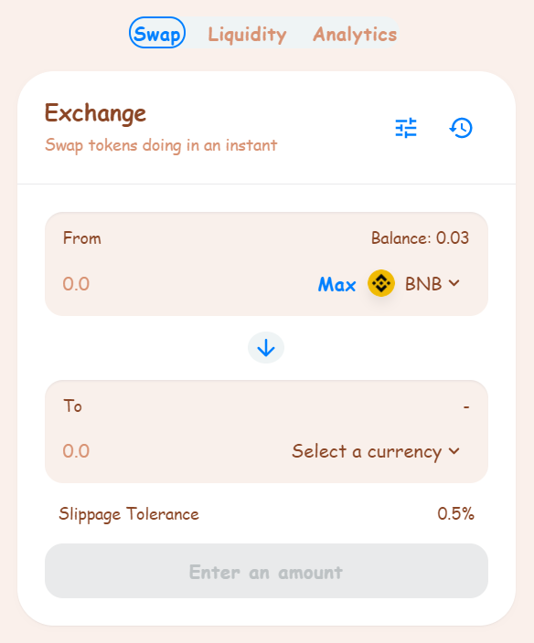
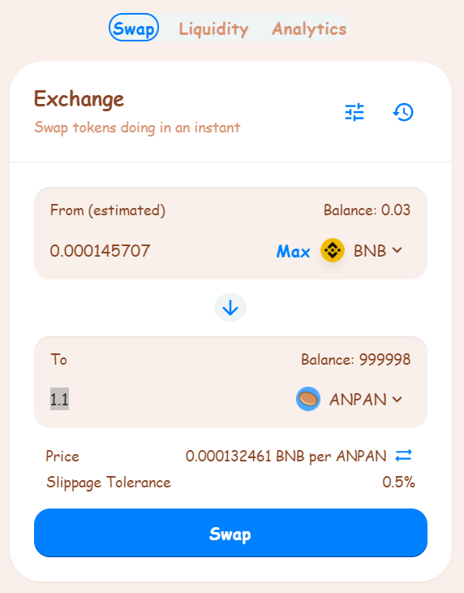
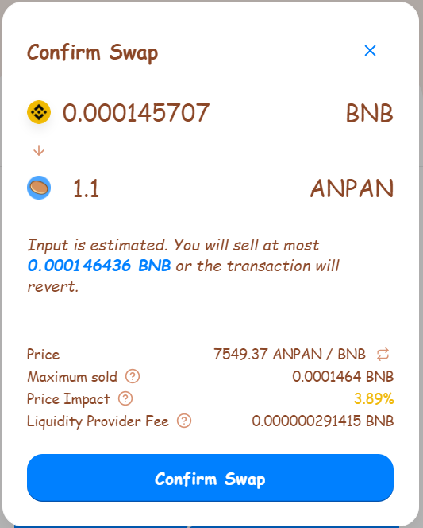
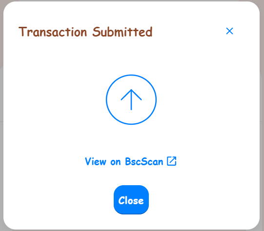

# How to Trade

Trading on AnpanSwap is very easy compared to most exchanges. You aren't going to be overwhelmed by charts or jargon, and calculations are all handled for you.

### Getting set up to trade

Before you can trade, you will need a Binance Smart Chain-compatible wallet. You can learn how to get one [here](https://docs.anpanswap.finance/#/get-started/wallet-guide). You will also need to have some BEP20 tokens to trade with. You can learn how to get some [here](https://docs.anpanswap.finance/#/get-started/bep20-guide).

### Trading on the AnpanSwap exchange

1. Go to the exchange page [here](https://exchange.anpanswap.finance/#/swap).

2. Unlock your Binance Smart Chain-compatible wallet by clicking **Unlock Wallet** \(you can also **Connect** in the top left-hand corner\). If you haven't yet connected your wallet to AnpanSwap, you can view the guide to [here](https://docs.anpanswap.finance/#/get-started/connection-guide).

3. Choose the token you want to trade from the dropdown menu in the "From" section. The default setting is BNB.

Whichever token you choose, you will need to make sure you have some to trade with. Your balance is shown above the token dropdown menu.

4. Choose the token you want to trade to in the "To" section as above. Next, type an amount for your "To" currency by clicking inside the input box.

Your "From" currency amount will be estimated automatically. You can also type your "From" amount and have the "To" amount estimate automatically if you like.

5. Check the details, and click the **Swap** button.

6. A window with more details will appear. Check the details are correct.

When you are ready, click the **Confirm Swap** button. Your wallet will ask you to confirm the action.

7. Done! You can click **View on BscScan** to see your transaction details on the explorer.

