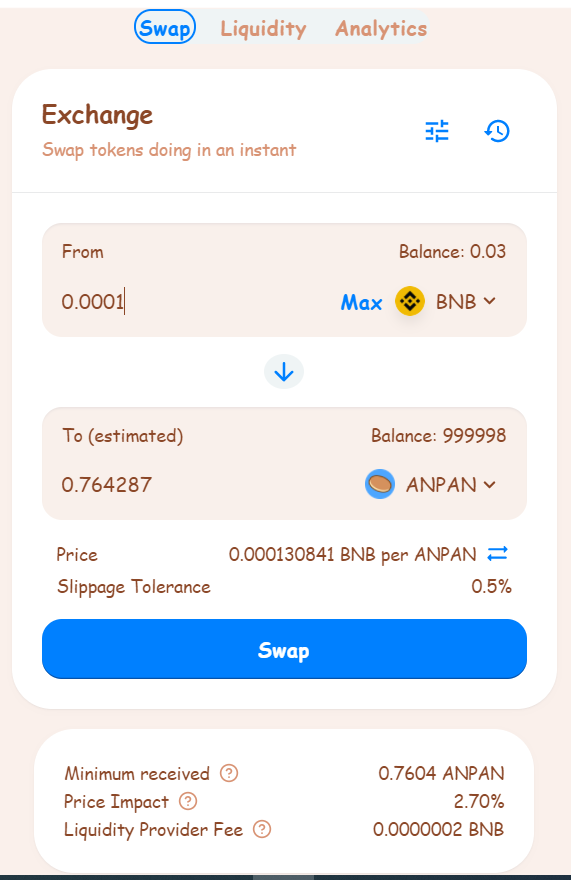

# Token Swaps

[**Token swaps**](https://exchange.anpanswap.finance/#/swap) on AnpanSwap are a simple way to trade one BEP-20 token for another via automated liquidity pools.

When you make a token swap \(trade\) on the exchange you will pay a **0.2% trading fee**, which is broken down as follows:

**0.17%** - Returned to Liquidity Pools in the form of a fee reward for liquidity providers.

**0.03%** - Sent to the AnpanSwap Treasury.