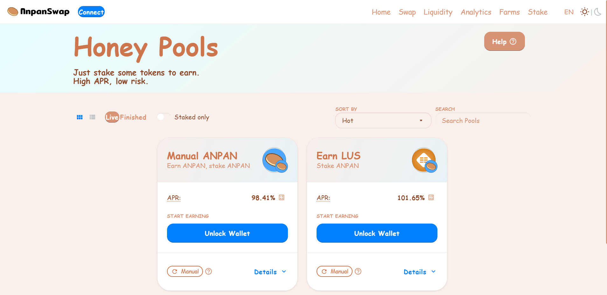
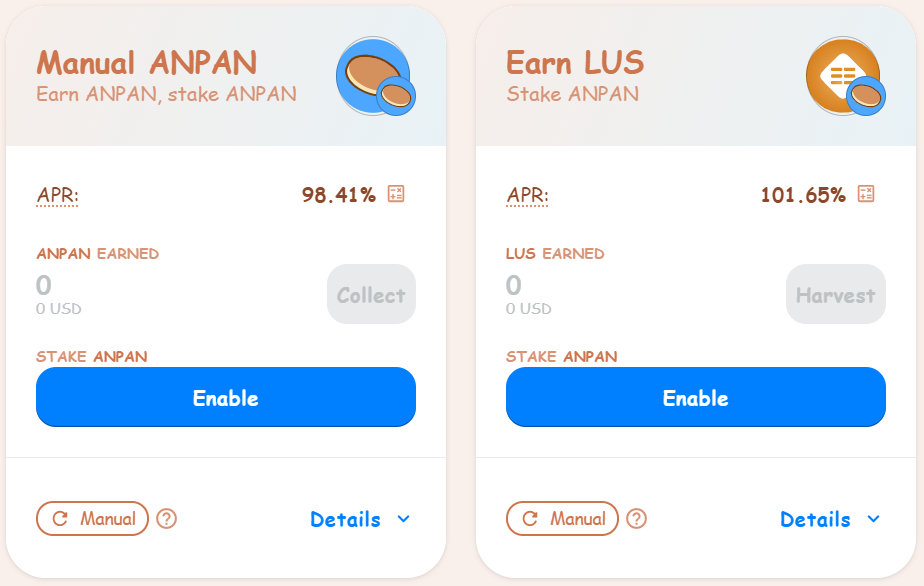
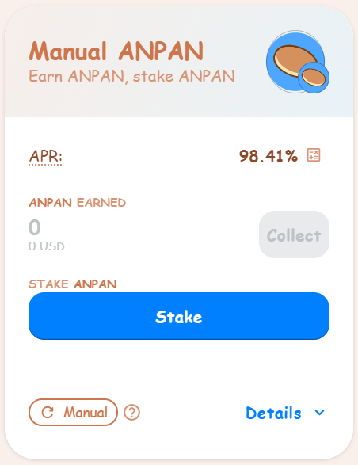
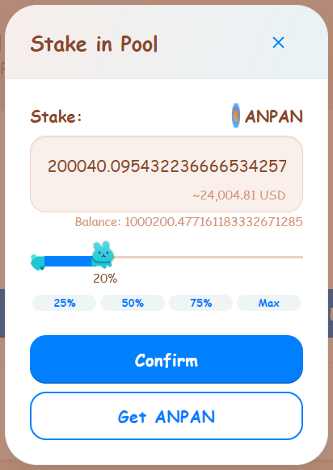
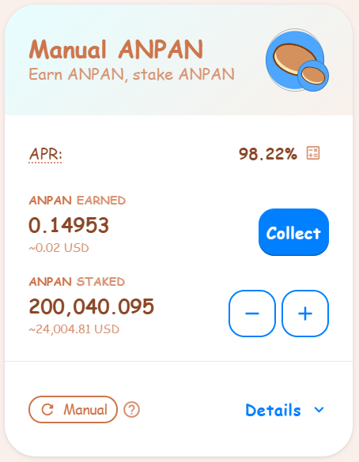
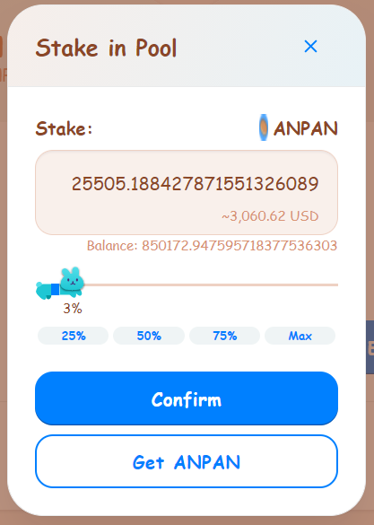
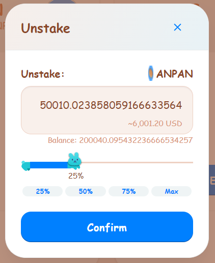

# How to Stake in Honey Pools
Honey Pools: the simplest way to earn on AnpanSwap

Staking in [Honey Pools](https://docs.anpanswap.finance/#/products/honey-pool/stake) lets you earn ANPAN or other tokens while you sleep!

It's simpler than farming with AnpanSwap's Yield Farms, because unlike the Farms, you only need to stake **one token** to start earning: usually ANPAN.

## **Getting started with Honey Pool staking**

1. Go to the Pools page [here](https://anpanswap.finance/pools).

2. Connect to your Binance Smart Chain-compatible wallet by clicking the **Connect** button \(top left-hand side\).

3. Or Click **Unlock Wallet**.

4. Choose which Honey Pool you want to stake in.

**Manual ANPAN Pool** let you stake your ANPAN to earn ANPAN. You’ll need to harvest and compound your earnings manually.

**Other Honey Pools** let you stake your ANPAN to earn other cool tokens. Make sure you check them out.  
****

5. Once you choose a pool, click the **Enable** button. Your wallet will ask you to confirm the action.

6. The Enable button should now be replaced with **Stake**. Click the button to bring up the staking menu.

7. Type in an amount or slide the rabbit to choose how much ANPAN you want to stake.

8. Click **Confirm**. Your wallet will ask you to confirm the action.

9. The Confirm button will change to **"Confirming"**, then once the transaction is successful, you’ll see your staked amount change and the button will change again.

10. You should now be able to see details on your Honey Pool. The pools will show a **Collect** button to claim your staking rewards into your wallet.

### **Adding and removing ANPAN from a pool** 

You can easily add more ANPAN to a Honey Pool, or move some ANPAN to a more profitable pool. Here’s how you can move your staked ANPAN.

1. Click the **-** to take some ANPAN out of a pool, or the **+** to add more to the pool.

2. A window will open. If you clicked the **+**, choose the amount you would like to add to the pool. If you clicked the **-**, choose the amount to take out of the pool.

3. Click **Confirm**.

4. After a little wait, you'll be able to see your new amount of staked tokens.

