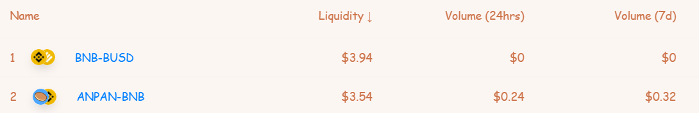

# 🚜 Yield Farming

Yield Farms allow users to earn ANPAN while supporting AnpanSwap by staking LP Tokens.

Check out our [How to Use Farms guide](https://docs.anpanswap.finance/#/products/yield-farming/how-to-use-farms) to get started with farming.

**Warning:** 
Yield farming can give better rewards than Honey Pools, but it comes with a risk of **Impermanent Loss**. It’s not as scary as it sounds, but it is worth learning about the concept before you get started.

Check out this great [article about Impermanent Loss ](https://academy.binance.com/en/articles/impermanent-loss-explained)from Binance Academy to learn more.

## Reward calculations

Yield Farm APR calculation includes both the rewards earned through providing liquidity and rewards earned staking LP Tokens in the Farm.

Below is a basic explanation of how APR is calculated.

In the image above of the ANPAN/BNB pair, we see these values:

**Liquidity:** $3.54  
**Volume 24H:** $0.24  
**Volume 7D:** $0.32

To calculate the APR, first we take the 24hour volume, $0.24, and calculate the fee-share of LP-holders, 0.17% \[**$0.24\*0.17/100 = $0.000408\]**.

Next, we estimate the yearly fees based on the 24h volume \[**$0.000408\*365 = $0.14892**\].

Now we can calculate the fee APR with yearly fees divided by liquidity **\[\($0.14892/$3.54\)\*100 = 4.21%\]**.

With the fee APR, we can add the fee APR \(4.21%\) and the Farm staking APR \(40.08%\) to get the new total APR **\[4.21%+40.08% = 44.29%\]**.