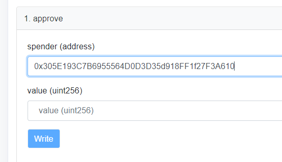

# How to Use Farms with BscScan

Since it requires several steps, using Farms with AnpanSwap can seem intimidating at first. This guide will walk you through using the Farms contract directly through BscScan.

**Warning:** 
Please understand that using BscScan to interact with contracts is not recommended for beginners. If you're not feeling confident, we suggest using the [How to Use Farms guide](https://docs.anpanswap.finance/#/products/yield-farming/how-to-use-farms) instead.

## Finding Farm process identifier

To interact correctly with the farming smart contract, you’ll need the matching process identifier \(PID\) for your LP pair. For now, the easiest way to locate this is to check GitHub.

1. Open the [AnpanSwap website’s Farms code on GitHub](https://github.com/anpanswap/anpan-frontend/blob/master/src/config/constants/farms.ts).

2. **Control**/**command** + **F** and search for your pair by ticker \(not project name\). For example, 'BUSD-ANPAN'.

3. Write down or copy the PID number—in this case 3—somewhere you can access it easily. You'll need this later.

## Depositing LP Tokens through BscScan

There are a few things involved in depositing LP Tokens using BscScan. We've broken it down into steps to make it easier to follow along.

### Getting the Main Staking Contract address

The address for the main staking contract is: **0x305E193C7B6955564D0D3D35d918FF1f27F3A610**

But assuming you'd like to confirm that, visit the [AnpanSwap: Main Staking Contract BscScan page](https://bscscan.com/address/0x305E193C7B6955564D0D3D35d918FF1f27F3A610#writeContract). You'll see the address in the top-left. Click the **copy icon** to copy this to clipboard. You'll need it soon.

### Open the contract for your LP Token

You'll need to approve the smart contract for the LP Token you wish to commit to a farm before you can spend it.

### From the source code

1. First, open [farms.ts on GitHub](https://github.com/anpanswap/anpan-frontend/blob/master/src/config/constants/farms.ts).

2. **Control**/**command** + **F** and search for your pair by ticker \(not project name\). For example, 'BUSD-ANPAN'

3. When you have the code for the LP pair you're looking for up, find the address after "56:". This will be your contract address.

### From the UI

1. First, visit the [AnpanSwap Farms page](https://anpanswap.finance/farms) and search for your chosen pair using the "SEARCH" field in the top right. We're using BUSD-ANPAN for this example.

2. Click **Details** to expand the row to show more information.

3. Click **View Contract** to open the smart contract on BscScan.

### Giving permission to the LP Token contract

Now that you have your LP Token's contract open on BscScan, you're going to approve the spending of your LP Tokens into the Farm.

1. On the LP Token's contract page, go to **Contract**, and then **Write Contract**.

2. Click **Connect to Web3** to connect MetaMask.

Confirm the connection.

3. Under function 1, “approve”, you’ll see “spender:address”. Paste in the Main Staking Contract’s address you copied to clipboard earlier.

4. You’re also going to need to approve the amount of LP Tokens the contract can spend. In the value field, you’ll need to enter the amount in Wei. You can use the [BscScan Unit Converter](https://www.bscscan.com/unitconverter) to easily change your amount into Wei. Here we'll use 0.03 BUSD-ANPAN LP Tokens.

**Warning:** 
You can also use `-1` as the value to give unlimited spend approval. This does not mean you will spend everything by default, but only that a transaction of any size using this contract will be allowed by your wallet.

5. Click **Write** and accept the action in your MetaMask wallet. You’re now able to commit LP Tokens to the Farm up to the amount you’ve approved.

### Deposit LP Tokens with the Main Staking Contract smart contract

With the Main Staking Contract now approved to spend your LP Tokens, it's time to make a deposit.

1. Back on the [AnpanSwap: Main Staking Contract BscScan page](https://bscscan.com/address/0x305E193C7B6955564D0D3D35d918FF1f27F3A610#writeContract), go to **Contract**, and then **Write Contract**.

2. Click **Connect to Web3** to connect MetaMask.

3. Scroll to function 2, "deposit", and type your PID into the "\_pid" field.

If you didn't copy down your PID earlier, you can learn how to get it in the **Finding Farm process identifier** section higher up this page.

4. Underneath \_pid you'll see "\_amount". Enter the amount for the LP contract to spend that you approved earlier.

5. Check the information and click **Write**. Confirm your action in MetaMask.

6. You can view the confirmation of your deposit worked by clicking **View your transaction**.

## Withdrawing from a Pool

Withdrawing your LP Tokens from a Pool is very similar to making a deposit. The difference is which function you'll interact with.

1. Back on the [AnpanSwap: Main Staking Contract BscScan page](https://bscscan.com/address/0x305E193C7B6955564D0D3D35d918FF1f27F3A610#writeContract), go to **Contract**, and then **Write Contract**.

2. Click **Connect to Web3** to connect MetaMask.

3. Scroll all the way down to function 15, "withdraw", and type your PID into the "\_pid" field.

If you didn't copy down your PID earlier, you can learn how to get it in the **Finding Farm process identifier** section higher up this page.

4. Underneath \_pid you'll see "\_amount". Enter the amount of LP you'd like to withdraw from the Pool.

5. Check the information and click **Write**. Confirm your action in MetaMask.

6. You can view the confirmation of your withdrawal worked by clicking **View your transaction**.

## **Making an emergency withdrawal**

‌Using the emergency withdraw function allows you to draw all your funds out of a pool when no other way is working.

**Danger:**  
**Using the emergency withdraw function will forfeit your ANPAN rewards!**

The AnpanSwap team strongly suggests avoiding this function unless advised to do so officially by the AnpanSwap team, or if you are very comfortable interacting with smart contracts and understand the underlying code.

‌1. On the [AnpanSwap: Main Staking Contract BscScan page](https://bscscan.com/address/0x305E193C7B6955564D0D3D35d918FF1f27F3A610#writeContract), go to **Contract**, and then **Write Contract**.

2. Click **Connect to Web3** to connect MetaMask.

‌3. Scroll down to function 4, "emergencyWithdraw", and type your PID into the "\_pid" field.

If you didn't copy down your PID earlier, you can learn how to get it in the **Finding Farm process identifier** section higher up this page.

5. Check the information and click **Write**. Confirm your action in MetaMask.

6. You can view the confirmation of your withdrawal worked by clicking **View your transaction**.

