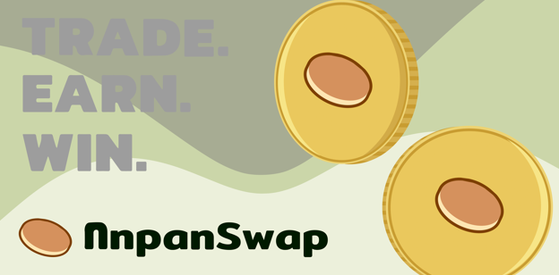

# AnpanSwap Intro

#### AnpanSwap helps you make the most out of your crypto in three ways:

#### Trade, Earn, and Win.

## ↔️ Trade

> Instantly swap crypto tokens: no registration or account needed.

### Low fees

Why pay more? AnpanSwap runs on Binance Smart Chain, a blockchain with much lower transaction costs than Ethereum or Bitcoin.   
Trading fees are lower than other top decentralized exchanges too, so that's a double win for you!

### Decentralized

Trade directly from your wallet app.   
Unlike centralized exchanges like Binance or Coinbase, AnpanSwap doesn’t hold your funds when you trade: **you have 100% ownership of your own crypto**. 

## 💸 Earn

> Earn ANPAN and other tokens for free with super high interest rates.

### Earn tokens with Honey Pools

Stake ANPAN, earn free tokens. It’s really that easy.   
ANPAN holders will earn millions of USD worth of free tokens each week from major projects. New projects join the party every day, so you can earn more, for even longer.

### Earn ANPAN with Yield Farms

Stake LP tokens, earn ANPAN. You take on a little more exposure to market fluctuations than with the Honey Pools, but can earn higher APR to offset the risk.

### Earn Trading Fees

No farm? No problem. Even if your trading pair isn’t supported on the Farms page, you can still earn trading fees when you stake your tokens in Liquidity Pools \(LPs\).

## 🎲 Win

> AnpanSwap makes making money fun.

### Prediction

**This product is coming soon**

### Lottery 

**This product is coming soon**

## Is AnpanSwap safe?

See for yourself:

* Transparent:
  * We’re built on open-source software: our site and all our Smart Contracts are publicly visible for maximum transparency. 
  * Our contracts are verified on BscScan so you know that what you see is what you get: [1](https://bscscan.com/address/0xe8d2c4ca811e0445B83326aBe85B7c40C66759eD#code) [2](https://bscscan.com/address/0x305E193C7B6955564D0D3D35d918FF1f27F3A610#code) [3](https://bscscan.com/address/0xEb4D933D56E5deF7B24F543766dD398f1DaFEEd5#code) [4](https://bscscan.com/address/0x14fA5493E17Aad701E3d59d90fB6D2814a39A176#code) [5](https://bscscan.com/address/0x45E8Eb81aE3445A88066058b566e58D535CA9D94#code) 
* Security best practices:
  * The chefs use multisig for all contracts.
  * Our contracts’ time-locks give you peace of mind.

**Sounds like fun?  
Then get flipping!** 🐰  
****

